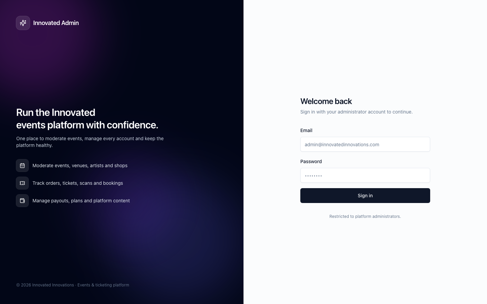
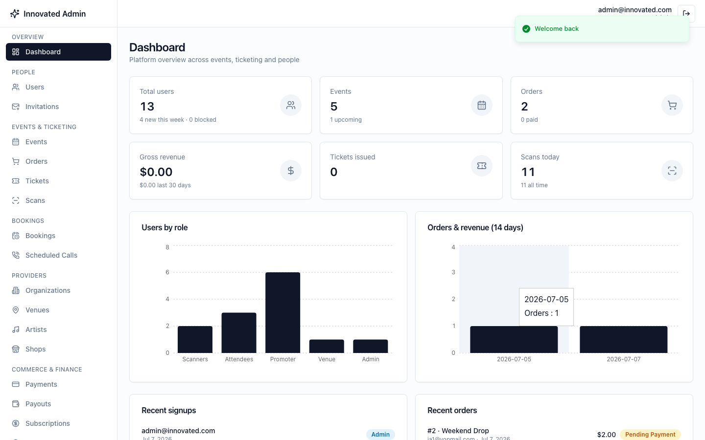
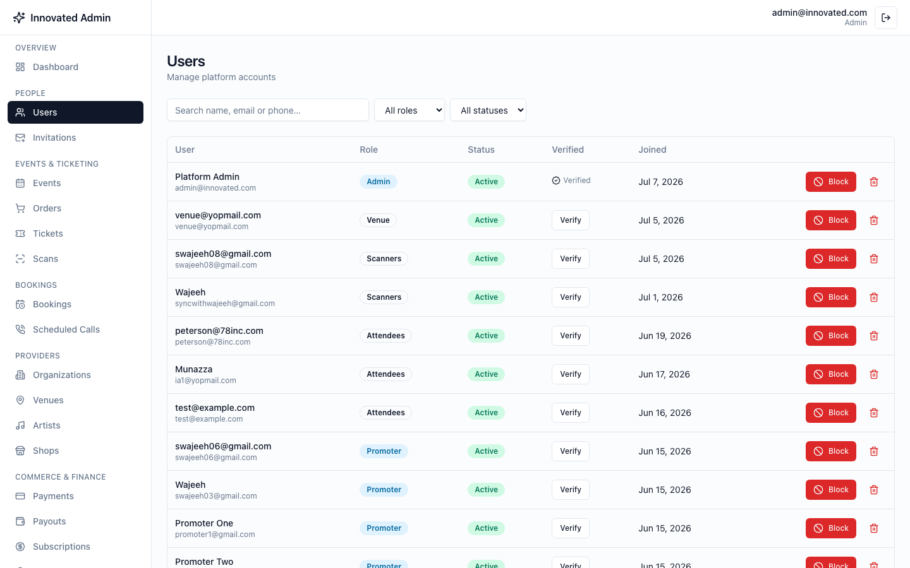
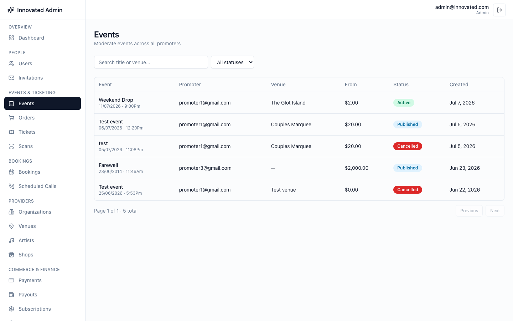
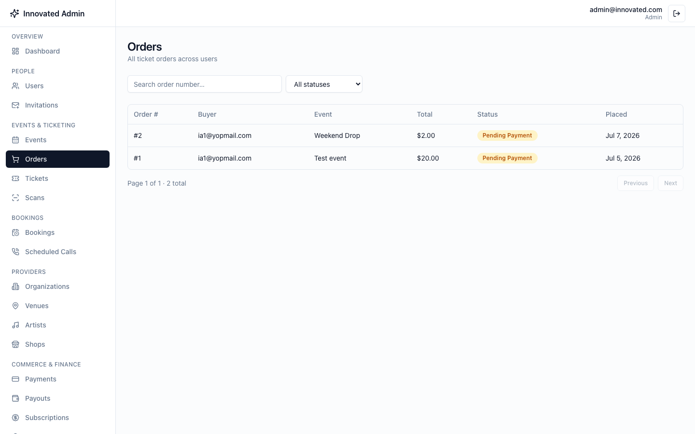

# Admin Panel — Built for Innovated Innovations

A complete, production-deployed admin panel for an events & ticketing
platform — built end-to-end, including the backend API it needed, in a
single engagement. Below is a look at the real, live product, followed by
the reusable process behind it.

## What's in the panel

A full back-office for running an events/ticketing platform: platform
analytics, user management with role-based access, event moderation across
every organizer, order/ticket/scan tracking, venue/artist/shop provider
management, payouts and subscription plans, and content controls (legal
pages, contact info, taxonomies) — all secured behind admin-only
authentication.

## Screenshots

**Sign-in** — branded, admin-only authentication.

**Dashboard** — live platform stats (users, events, orders, revenue), a
role breakdown, a 14-day orders/revenue trend, and recent activity feeds.

**User management** — search and filter every account on the platform,
verify or block users, all role-aware.

**Event moderation** — every event across every organizer, with status,
pricing, and venue at a glance.

**Order tracking** — every ticket order platform-wide, searchable by order
number and filterable by payment status.

## The process behind it

This panel was researched, designed, built, deployed, and verified against
a live URL — not just handed over as code. That process is captured as a
reusable methodology in [`skill/build-admin-panel/`](skill/build-admin-panel/SKILL.md):

1. **Research the target app** — read the real backend schemas, guards, and
   response contracts (not just a route list) before designing anything.
2. **Surface scope decisions up front** — what's in scope, how ownership/
   access works, how uploads are handled — as explicit questions, not
   assumptions.
3. **Design a phased plan** — backend admin API, then core (auth +
   dashboard), then one feature domain at a time.
4. **Build phase by phase**, checking types/builds on both sides as it goes.
5. **Verify for real** — drive an actual browser through login, every page,
   and a real write, not just "it compiles."
6. **Deploy** — CI/CD reuse, CORS handled explicitly, and the account
   seeded and confirmed working against the live URL, exactly as shown
   above.

Same process, any stack — hand it a different app and it builds the same
way.
